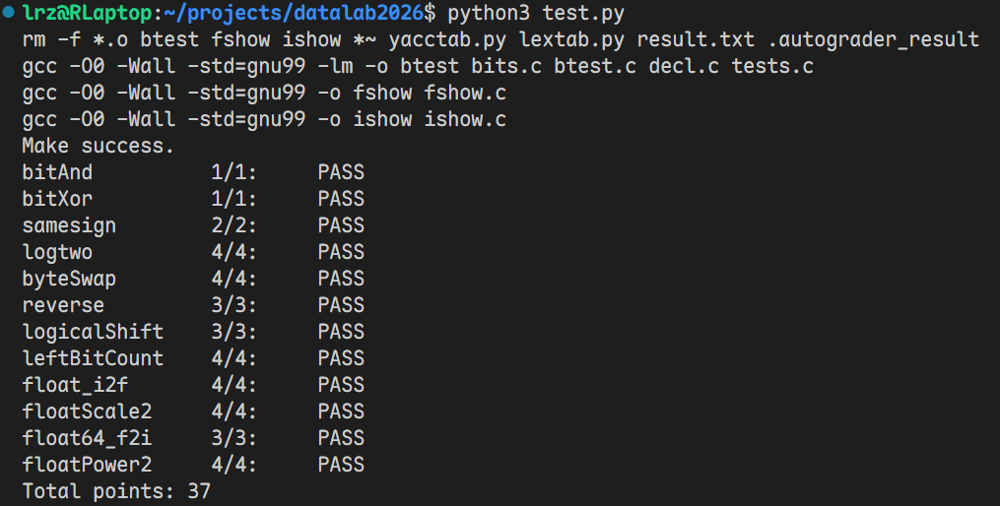

# datalab 报告

姓名：李润泽

学号：2025201824

## 测试结果

| 函数 | 得分 | 操作符数 / 上限 | 脚本结果 |
| --- | --- | --- | --- |
| bitAnd | 1/1 | 4/7 | PASS |
| bitXor | 1/1 | 7/7 | PASS |
| samesign | 2/2 | 8/12 | PASS |
| logtwo | 4/4 | 21/25 | PASS |
| byteSwap | 4/4 | 15/17 | PASS |
| reverse | 3/3 | 7/30 | PASS |
| logicalShift | 3/3 | 9/20 | PASS |
| leftBitCount | 4/4 | 33/50 | PASS |
| float_i2f | 4/4 | 30/30 | PASS |
| floatScale2 | 4/4 | 12/30 | PASS |
| float64_f2i | 3/3 | 20/60 | PASS |
| floatPower2 | 4/4 | 9/30 | PASS |
| **总分** | **37/37** | — | **全部通过** |

## 解题报告

### bitAnd

只有两个对应位均为 1 时，结果位才为 1，可以用“|”的0实现类似效果，因此将按位与写成 `~(~x | ~y)`。

### bitXor

用 `~(x & y)` 排除两个对应位同时为 1 的情况，用 `~(~x & ~y)` 排除同时为 0 的情况，再将两者按位与，得到仅在对应位不同时为 1 的异或结果。

### samesign

两个数均非零时，分别算术右移 31 位，得到 0 或全 1 的符号信息，再对异或结果取逻辑非，判断符号是否相同。零既非正数也非负数，单独讨论。

### logtwo

正整数以 2 为底的对数向下取整，等于最高有效 1 的下标。依次检查右移 16、8、4、2 位后是否非零；若非零，就记录该偏移，逐步缩小定位范围直到只剩下`v >> 1` 。为了实现乘法和加法的效果，用左移记录了偏移量，最后用或实现了求和，得到总偏移即结果。

### byteSwap

将字节下标左移 3 位实现乘 8 ，得到对应的偏移量。先右移，用 `0xFF`取出两个对应字节，再用移动和取反得到掩码清空原位置，将保存的字节移到对方位置并按位或写回。

### reverse

先将输入最低位写入结果，再循环 31 次：结果左移，输入右移，将新的最低位写入结果，完成 32 位反转。输入和结果采用无符号类型，右移时补零。

### logicalShift

主要问题在负数右移的自动补1，所以先预设左端为0，n为1的掩码。然后用`m=n+0xFFFFFFFF+(!n)`算出残余偏移量，且防止n=0时m为负，出现未定义操作。`mask=(mask<<(!n)|1)`特殊处理了n=0情况，最后移动并使用掩码。

### leftBitCount

依次检查最高 16、8、4、2、1 位是否全为 1。算术右移后若得到全 1，表达式 `!(~(x >> k))` 就为 1，据此累计块长并左移输入，继续检查剩余部分；否则缩小检查范围。这些块长之和为 31，最后再检查一次最高位，使全 1 输入的计数达到 32。

### float_i2f

先记录符号并求幅值，零直接返回；通过反复右移确定最高有效 1 的位置，作为实际指数。若指数不超过 23，左移对齐有效位即可精确表示；否则保留最高 24 位，并根据舍弃部分舍入：超过半值时进位，恰好等于半值时仅在保留部分最低位为 1 时进位，实现就近舍入、居中取偶。

若舍入使有效数进位到第 25 位，则阶码加 1。最后去掉隐含的最高位，将符号位、加上偏置 127 的阶码和低 23 位尾数拼接起来。

### floatScale2

拆出符号、阶码和尾数，符号保持不变。阶码全为 1 时原样返回，保留无穷和 NaN；阶码为 0 时将尾数左移一位，若原尾数最高位为 1，则将阶码置为 1，转入规格化范围。其余情况将阶码加 1，再拼接各部分。

### float64_f2i

从高 32 位提取符号和阶码，计算实际指数 `E = exp - 1023`。NaN、无穷或 `E > 31` 时返回 `0x80000000`；`E < 0` 时向零截断为 0。

补上有效数隐含的最高位 1 后，若 `E <= 20`，只需右移高字中的有效数；否则左移高字中的有效数，并从低字补入所需位。移位直接舍弃小数部分，实现向零截断。负数分支返回幅值的相反数；非负数分支在 `E >= 31` 时返回溢出标志，其余返回幅值。

### floatPower2

按指数范围直接构造结果。`x < -149` 时低于最小非规格化数，返回 0；`-149 <= x < -126` 时，用 `1 << (x + 149)` 在尾数区设置对应位；`-126 <= x <= 127` 时，尾数为 0，将加上偏置的阶码左移 23 位，返回 `(x + 127) << 23`；`x > 127` 时超出范围，返回正无穷 `0x7F800000`。

## 实验总结

这次lab重点在把对位操作、整数和浮点数编码的理解落实到具体运算中。解题时，需要先明确每一部分的含义，再用掩码、移位和逻辑运算等组织出结果，还要用位运算进行一些操作符的等价表达。整体来看，难点既在于从需求出发构造逻辑过程，也在于考虑各种边界，还有一些操作的细节，比如int右移自动补0和补1等等不同情况。综合应对各种各样的问题才可以跑通一个简单的想法。这次lab帮助我加深了对这部分知识的理解。

## 参考资料
教材与课件